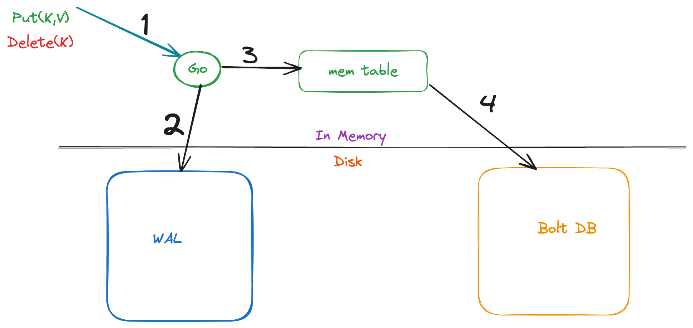

## kvalchemy 🚀
> A Hybrid Key-Value Store for Fast Writes, Efficient Reads, and Seamless Replication


## Overview

kvalchemy is a high-performance, replicated key-value store that blends the best of WALs, Memtables, and B-Trees to achieve:

✅ Blazing-fast writes without LSM compaction overhead.

✅ Optimized range queries with minimal disk I/O using B-Trees

✅ Efficient replication via gRPC WAL streaming & B-Tree snapshots

✅ Seamless multi-region scaling with rapid failover

## Why kvalchemy?

Traditional KV stores force a trade-off:

•	LSM-Trees (e.g., RocksDB) are great for fast writes but suffer from high read amplification & expensive compactions.

•	B+Trees (e.g., BoltDB) provide efficient lookups but struggle with high-speed inserts & replication.

### kvalchemy merges both worlds by:

•	Using Write-Ahead Logging (WAL) for durability & replication.

•	Leveraging Memtables (Skiplists) for rapid ingestion.

•	Storing data in B-Trees, enabling efficient queries & instant snapshots.

Architecture

kvalchemy is designed to scale efficiently across distributed environments:

## Storage Engine



## Development
```sh
make lint
make test
```

## certificate for Local host

```shell
brew install mkcert

## install local CA
mkcert -install

## Generate gRPC TLS Certificates
## these certificate are valid for hostnames/IPs localhost 127.0.0.1 ::1

mkcert -key-file grpc.key -cert-file grpc.crt localhost 127.0.0.1 ::1

```

## License

[Apache License, Version 2.0](https://www.apache.org/licenses/LICENSE-2.0)