## UnisonDB


> A multi-modal database combining WAL-based writes, B-Tree reads, and seamless replication — supporting KV, wide-column, and LOB data models with explicit transactions.

[](https://github.com/ankur-anand/unisondb/actions/workflows/go.yml)
[](https://coveralls.io/github/ankur-anand/unisondb?branch=main)

## What UnisonDB Offers

UnisonDB is a multi-modal replicated database that blends WALs, Memtables, and B-Trees to deliver:

* Fast writes - Write data quickly without background cleanup slowing you down
* Fast reads - Find your data efficiently, even across large ranges
* Built-in replication - Automatically sync data to multiple edge nodes
* Handle large files - Store videos, images, and documents as easily as simple values
* Flexible data structure - Update just one field without rewriting entire records

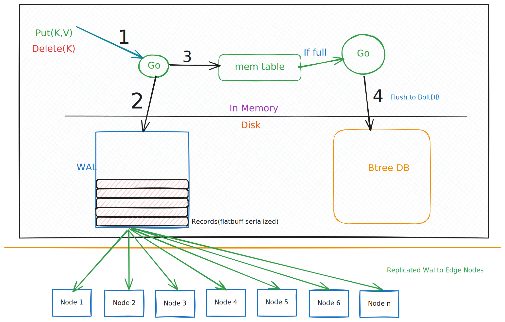

## Core Architecture 

UnisonDB is built on three foundational layers:

1. **WALFS** - Write-Ahead Log File System (mmap-based, optimized for reading at scale).
2. **Engine** - Hybrid storage combining WAL, MemTable, and B-Tree
3. **Replication** - WAL-based streaming with offset tracking

## 1. WALFS (Write-Ahead Log)

### Overview

WALFS is a memory-mapped, segmented write-ahead log implementation designed for **both writing AND reading at scale**. 
Unlike traditional WALs that optimize only for sequential writes, WALFS provides efficient random access for replication, and real-time tailing.

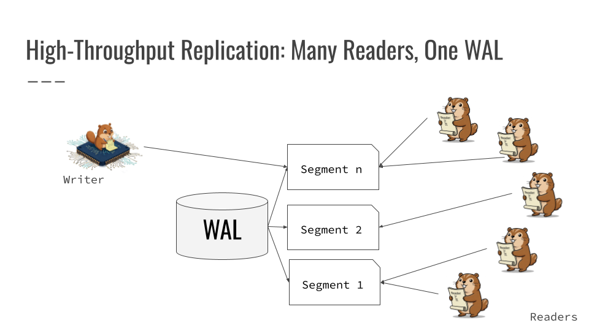

### Segment Structure

Each WALFS segment consists of two regions:

```
+----------------------+-----------------------------+-------------+
|   Segment Header     |        Record 1             |  Record 2   |
|     (64 bytes)       |  Header + Data + Trailer    |     ...     |
+----------------------+-----------------------------+-------------+
```

#### Segment Header (64 bytes)

| Offset | Size | Field           | Description                                  |
|--------|------|-----------------|----------------------------------------------|
| 0      | 4    | Magic           | Magic number (`0x5557414C`)                  |
| 4      | 4    | Version         | Metadata format version                      |
| 8      | 8    | CreatedAt       | Creation timestamp (nanoseconds)             |
| 16     | 8    | LastModifiedAt  | Last modification timestamp (nanoseconds)    |
| 24     | 8    | WriteOffset     | Offset where next chunk will be written      |
| 32     | 8    | EntryCount      | Total number of chunks written               |
| 40     | 4    | Flags           | Segment state flags (e.g. Active, Sealed)    |
| 44     | 12   | Reserved        | Reserved for future use                      |
| 56     | 4    | CRC             | CRC32 checksum of first 56 bytes             |
| 60     | 4    | Padding         | Ensures 64-byte alignment                    |

#### Record Format (8-byte aligned)

Each record is written in its own aligned frame:

| Offset  | Size     | Field   | Description                                      |
|---------|----------|---------|--------------------------------------------------|
| 0       | 4 bytes  | CRC     | CRC32 of `[Length \| Data]`                      |
| 4       | 4 bytes  | Length  | Size of the data payload in bytes                |
| 8       | N bytes  | Data    | User payload (FlatBuffer-encoded LogRecord)      |
| 8 + N   | 8 bytes  | Trailer | Canary marker (`0xDEADBEEFFEEEDFACE`)            |
| ...     | ≥0 bytes | Padding | Zero padding to align to 8-byte boundary         |

### WALFS Reader Capabilities

WALFS provides powerful reading capabilities essential for replication and recovery:

#### 1. **Forward-Only Iterator**

```go
reader := walLog.NewReader()
defer reader.Close()

for {
    data, pos, err := reader.Next()
    if err == io.EOF {
        break
    }
    // Process record
}
```

- **Zero-copy reads** - data is a memory-mapped slice
- **Position tracking** - each record returns its `(SegmentID, Offset)` position
- **Automatic segment traversal** - seamlessly reads across segment boundaries

#### 2. **Offset-Based Reads**

```go
// Read from a specific offset (for replication catch-up)
offset := Offset{SegmentID: 5, Offset: 1024}
reader, err := walLog.NewReaderWithStart(&offset)
```

#### Use cases:

* Efficient seek without scanning
* Follower catch-up from last synced position
* Recovery from checkpoint

#### 3. **Active Tail Following**

```go
// For real-time replication (tailing active WAL)
reader, err := walLog.NewReaderWithTail(&offset)

for {
    data, pos, err := reader.Next()
    if err == ErrNoNewData {
        // No new data yet, can retry or wait
        continue
    }
}
```
#### Behavior:

* Returns ErrNoNewData when caught up (not io.EOF)
* Enables low-latency streaming
* Supports multiple parallel readers

### Why WALFS is Different
Unlike traditional "write-once, read-on-crash" WALs, WALFS optimizes for:

* Continuous replication - Followers constantly read from primary's WAL
* Real-time tailing - Low-latency streaming of new writes
* Parallel readers - Multiple replicas read concurrently without contention

---

## 2. Engine (dbkernel)

### Overview

The Engine orchestrates writes, reads, and persistence using three components:

* WAL (WALFS) - Durability and replication source
* MemTable (SkipList) - In-memory write buffer
* B-Tree Store - Persistent index for efficient reads

### Flow Diagram

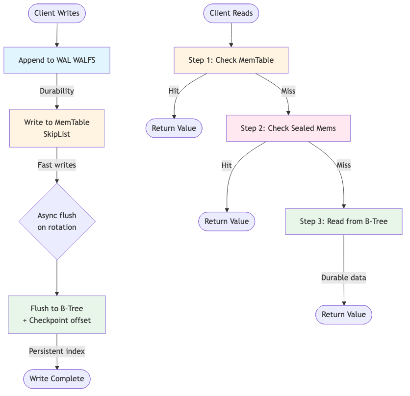

### FlatBuffer Schema

UnisonDB uses FlatBuffers for zero-copy serialization of WAL records:
#### Benefits:

* No deserialization on replicas
* Fast replication

#### Why FlatBuffers?

**Replication efficiency** - No deserialization needed on replicas

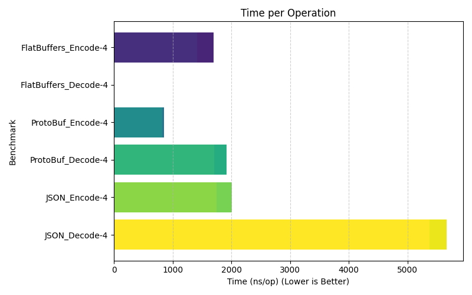 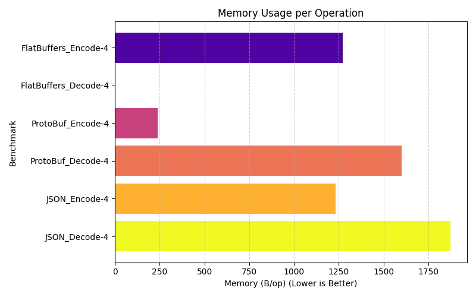

### Transaction Support
UnisonDB provides **atomic multi-key transactions**:

```go
txn := engine.BeginTxn()
txn.Put("k1", value1)
txn.Put("k2", value2)
txn.Put("k3", value3)
txn.Commit() // All or nothing
```
#### Flow

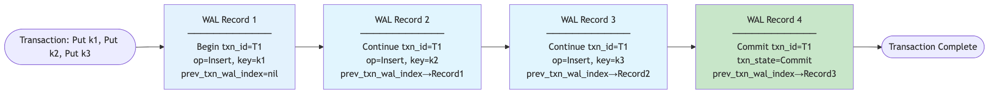

**Transaction Properties:**
- **Atomicity** - All writes become visible on commit, or none on abort
- **Isolation** - Uncommitted writes are hidden from readers

### LOB (Large Object) Support

Large values can be chunked and streamed using TXN.

#### Flow

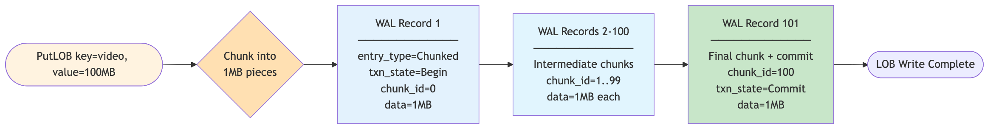

**LOB Properties:**
- **Transactional** - All chunks committed atomically
- **Streaming** - Can write/read chunks incrementally
- **Efficient replication** - Replicas get chunks as they arrive

### Wide-Column Support

UnisonDB supports partial updates to column families:

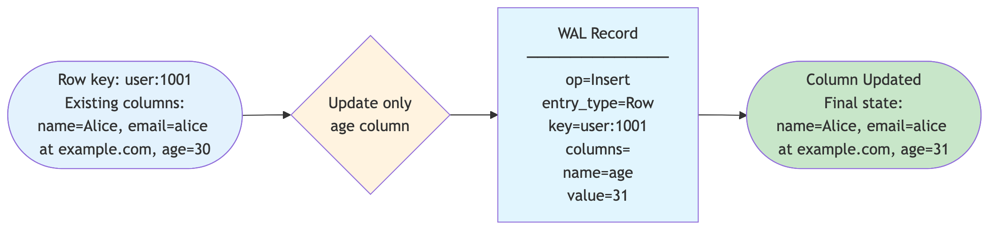

**Benefits:**
- **Efficient updates** - Only modified columns are written/replicated
- **Flexible schema** - Columns can be added dynamically
- **Merge semantics** - New columns merged with existing row

---

## 3. Replication Architecture

### Overview

Replication in UnisonDB is **WAL-based streaming** - designed around the WALFS reader capabilities. Followers continuously stream WAL records from the primary's WALFS and apply them locally.

### Design Principles

1. **Offset-based positioning** - Followers track their replication offset `(SegmentID, Offset)`
2. **Catch-up from any offset** - Can resume replication from any position
3. **Real-time streaming** - Active tail following for low-latency replication
4. **Self-describing records** - FlatBuffer LogRecords are self-contained
5. **Batched streaming** - Records sent in batches for efficiency

### Replication Flow

* Offset-based positioning - Followers track (SegmentID, Offset) Independently.
* Catch-up from any offset - Resume from any position
* Real-time streaming - Active tail following for low latency

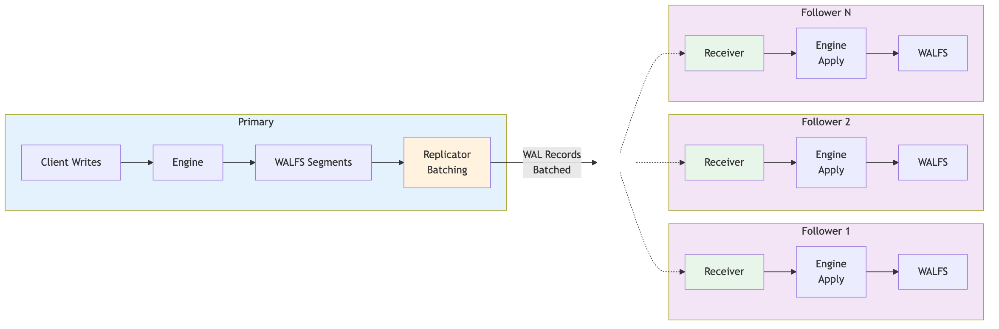

## Performance Testing: Local Replication

### Test Setup

We validated the WAL-based replication architecture using the `pkg/replicator` component in a local test environment. 
We Fuzzed the Write Path with all supported operations including Put, BatchPut, Delete, and row-column mutations.
This tests the core replication mechanics without network overhead.

> Server Running on Digitalocean s-8vcpu-16gb-480gb-intel

### Test Parameters

* 1000 Concurrent Readers: Simulates heavy read load alongside writes
* 1000 Operations per Second: Sustained write throughput
* Mixed Workload: Combines small metadata updates (100B) with larger payloads (100KB)
* Isolation Testing: Validates transaction isolation under concurrent access patterns

Each replication stream operates as an independent WAL reader, capturing critical performance metrics:

Physical Latency Tracking: Measures p50, p90, p99, and max latencies using timestamps

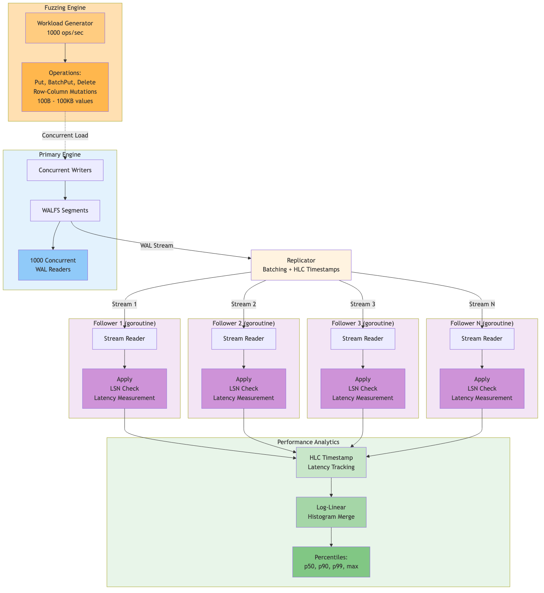

### Replication Latency Under Pressure

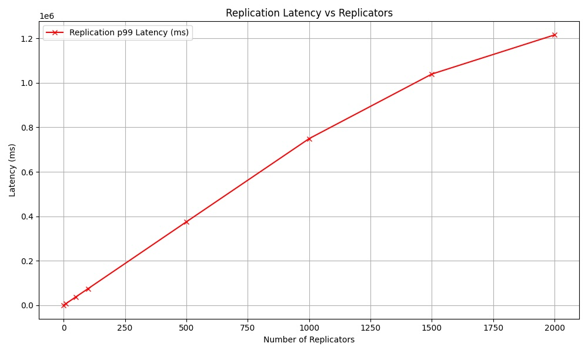

### Replication Throughput

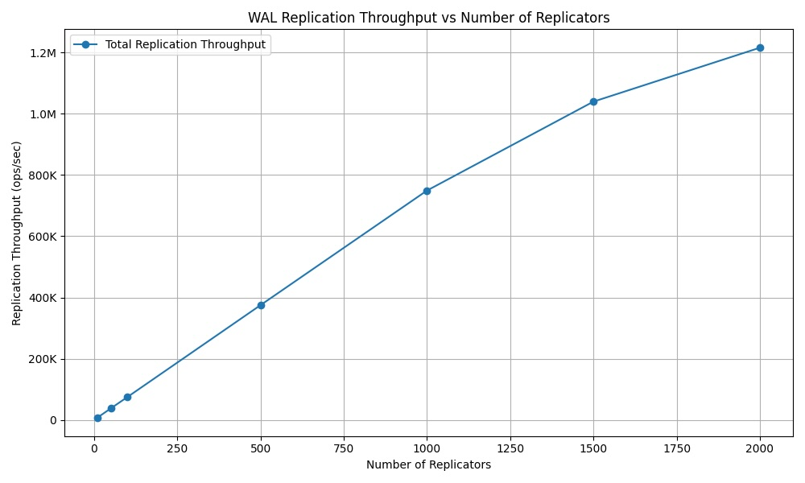

### Fuzzing Latency (write path)

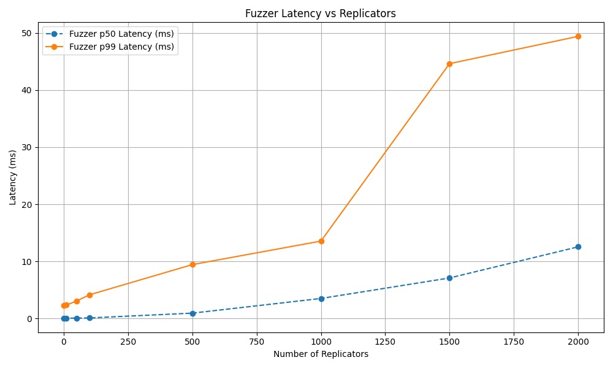


### Throughput Holds — Until It Doesn’t

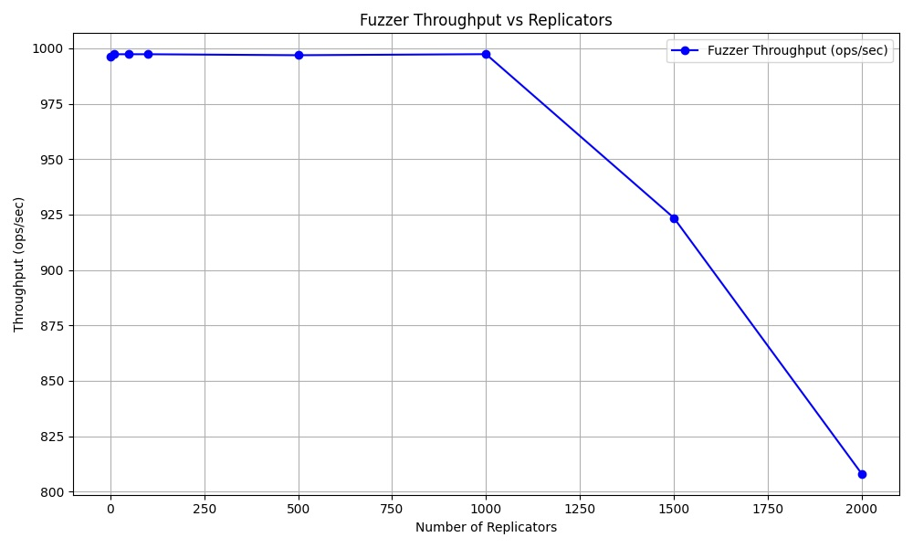 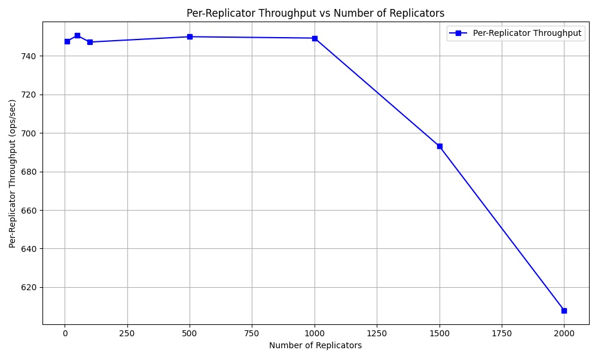


---


## Why is Traditional KV Replication Insufficient?

> Most traditional key-value stores were designed for simple, point-in-time key-value operations — and their replication 
models reflect that. While this works for basic use cases, it quickly breaks down under real-world 
demands like multi-key transactions, large object handling, and fine-grained updates.

### Key-Level Replication Only

Replication is often limited to raw key-value pairs. 
There’s no understanding of higher-level constructs like rows, columns, 
or chunks — making it impossible to efficiently replicate partial updates or large structured objects.

### No Transactional Consistency

Replication happens on a per-operation basis, not as part of an atomic unit.
Without multi-key transactional guarantees, systems can fall into inconsistent states across replicas, 
especially during batch operations, network partitions, or mid-transaction failures.

### Chunked LOB Writes Become Risky

When large values are chunked and streamed to the store, traditional replication models expose chunks as they arrive. 
If a transfer fails mid-way, replicas may store incomplete or corrupted objects, with no rollback or recovery mechanism.

### No Awareness of Column-Level Changes

Wide-column data is treated as flat keys or opaque blobs. If only a single column is modified, 
traditional systems replicate the entire row, wasting bandwidth, 
increasing storage overhead, and making efficient synchronization impossible.

### Operational Complexity Falls on the User

Without built-in transactional semantics, developers must implement their own logic for deduplication, 
rollback, consistency checks, and coordination — which adds fragility and complexity to the system.

### Storage Engine Tradeoffs

•	LSM-Trees (e.g., RocksDB) excel at fast writes but suffer from high read amplification and costly background compactions, which hurt latency and predictability.

•	B+Trees (e.g., BoltDB,LMDB) offer efficient point lookups and range scans, but struggle with high-speed inserts and lack native replication support.
 
## How UnisonDB Solves This. :white_check_mark:

UnisonDB combines append-only logs for high-throughput ingest with B-Trees for fast and efficient range reads — while offering:

* Transactional, multi-key replication with commit visibility guarantees.
* Chunked LOB writes that are fully atomic.
* Column-aware replication for efficient syncing of wide-column updates.
* Isolation by default — once a network-aware transaction is started, all intermediate writes are fully isolated and not visible to readers until a successful txn.Commit().
* Built-in replication via gRPC WAL streaming + B-Tree snapshots.
* Zero-compaction overhead, high write throughput, and optimized reads.

## Development
```sh
make lint
make test
```

## certificate for Local host

```shell
brew install mkcert

## install local CA
mkcert -install

## Generate gRPC TLS Certificates
## these certificate are valid for hostnames/IPs localhost 127.0.0.1 ::1

mkcert -key-file grpc.key -cert-file grpc.crt localhost 127.0.0.1 ::1

```

## License

[Apache License, Version 2.0](https://www.apache.org/licenses/LICENSE-2.0)