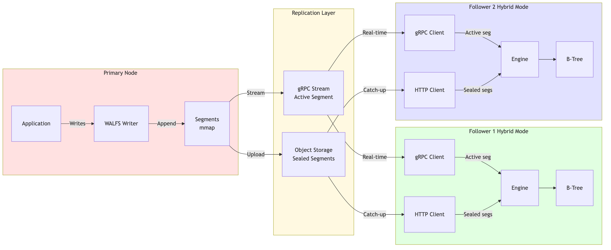
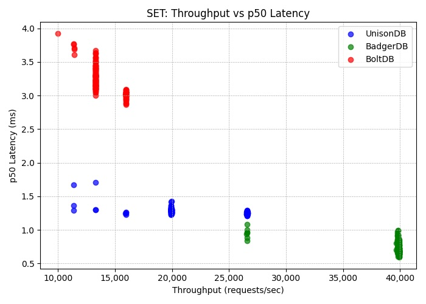

## UnisonDB

> Store, stream, and sync instantly — **UnisonDB** is a **log-native, real-time database** that replicates like a **message bus for AI and Edge Computing**.


[](https://github.com/ankur-anand/unisondb/actions/workflows/go.yml)
[](https://coveralls.io/github/ankur-anand/unisondb?branch=main)
[](LICENSE)
[](https://unisondb.io/docs/getting-started/)
[](#)

## What UnisonDB Is

UnisonDB is an open-source database designed specifically for [**Edge AI**](https://www.ibm.com/think/topics/edge-ai) and [**Edge Computing**](https://en.wikipedia.org/wiki/Edge_computing).  

It is a **reactive**, [**log-native**](https://www.unisondb.io/docs/architecture/) and [**multi-model database**](https://en.wikipedia.org/wiki/Multi-model_database) built for real-time and edge-scale applications.  UnisonDB combines a [**B+Tree storage engine**](https://en.wikipedia.org/wiki/B%2B_tree) with WAL-based ([**Write-Ahead Logging**](https://en.wikipedia.org/wiki/Write-ahead_logging)) streaming replication, enabling near-instant fan-out replication across hundreds of nodes — all while preserving strong consistency and durability.

## Key Features
- **Multi-Modal Storage**: Key-Value, Wide-Column, and Large Objects (LOB)
- **Streaming Replication**: WAL-based replication with sub-second fan-out to 100+ edge replicas
- **Real-Time Notifications**: ZeroMQ-based change notifications with sub-millisecond latency
- **Durable & Fast**: B+Tree storage with Write-Ahead Logging
- **Edge-First Design**: Optimized for edge computing and local-first architectures
- **Namespace Isolation**: Multi-tenancy support with namespace-based isolation


## Use Cases

UnisonDB is built for **distributed edge-first architectures** systems where **data and computation must live close together** — reducing network hops, minimizing latency, and enabling real-time responsiveness at scale.

By **co-locating data with the services that use it**, UnisonDB removes the traditional boundary between the database and the application layer.
Applications can react to local changes instantly, while UnisonDB’s WAL-based replication ensures eventual consistency across all replicas globally.

## Quick Start

```bash
# Clone the repository
git clone https://github.com/ankur-anand/unisondb
cd unisondb

# Build
go build -o unisondb ./cmd/unisondb

# Run in replicator mode (primary)
./unisondb --config config.toml replicator

# Use the HTTP API
curl -X PUT http://localhost:4000/api/v1/default/kv/mykey \
  -H "Content-Type: application/json" \
  -d '{"value":"bXl2YWx1ZQ=="}'
```

## Documentation

1. [Getting Started with UnisonDB](https://unisondb.io/docs/getting-started/)
2. [Complete Configuration Guide](https://unisondb.io/docs/getting-started/configurations/)
3. [Architecture Overview](https://unisondb.io/docs/architecture/)
4. [HTTP API Reference](https://unisondb.io/docs/api/http-api/)
5. [Backup and Restore](https://unisondb.io/docs/operations/backup-restore/)
6. [Deployment Topologies](https://unisondb.io/docs/deployment/)

## Redis-Compatible Benchmark: UnisonDB vs BadgerDB vs BoltDB

This benchmark compares the **write and read performance** of three databases — **UnisonDB**, **BadgerDB**, and **BoltDB** — using a Redis-compatible interface and the official [`redis-benchmark`](https://redis.io/docs/latest/operate/oss_and_stack/management/optimization/benchmarks/) tool.

### What We Measured

- **Throughput**: Requests per second for `SET` (write) and `GET` (read) operations
- **Latency**: p50 latency in milliseconds
- **Workload**: 50 iterations of mixed `SET` and `GET` operations (200k ops per run)
- **Concurrency**: 100 parallel clients, 10 pipelined requests, 4 threads

### Test Environment

```
Chip: Apple M2 Pro
Total Number of Cores: 10 (6 performance and 4 efficiency)
Memory: 16 GB
```

All three databases were tested under identical conditions to highlight differences in write path efficiency, read performance, and I/O characteristics. The Redis-compatible server implementation can be found in `internal/benchtests/cmd/redis-server/`.

### Results


## Performance Testing: Local Replication

### Test Setup

We validated the WAL-based replication architecture using the `pkg/replicator` component in a local test environment. 
We Fuzzed the Write Path with all supported operations including Put, BatchPut, Delete, and row-column mutations.
This tests the core replication mechanics without network overhead.

> Server Running on Digitalocean s-8vcpu-16gb-480gb-intel

### Test Parameters

* 1000 Concurrent Readers: Simulates heavy read load alongside writes
* 1000 Operations per Second: Sustained write throughput
* Mixed Workload: Combines small metadata updates (100B) with larger payloads (100KB)
* Isolation Testing: Validates transaction isolation under concurrent access patterns

Each replication stream operates as an independent WAL reader, capturing critical performance metrics:

Physical Latency Tracking: Measures p50, p90, p99, and max latencies using timestamps


### Replication and Fuzzer(write path) Latency Under Pressure

 

### Replication Throughput


## Why UnisonDB

> Traditional databases persist. Stream systems propagate.
UnisonDB does both — turning every write into a durable, queryable stream that replicates seamlessly across the edge.

### The Problem: Storage and Streaming Live in Different Worlds

Modern systems are reactive — every change needs to **propagate instantly** to dashboards, APIs, caches, and edge devices.  
Yet, databases were built for persistence, not propagation.

You write to a database, then stream through Kafka.  
You replicate via CDC.  
You patch syncs between cache and storage.

This split between **state and stream** creates friction:
- Two systems to maintain and monitor
- Eventual consistency between write path and read path
- Network latency on every read or update
- Complex fan-out when scaling to hundreds of edges

---

### The Gap

**LMDB** and **BoltDB** excel at local speed — but stop at one node.  
**etcd** and **Consul** replicate state — but are consensus-bound and small-cluster only.  
**Kafka** and **NATS** stream messages — but aren’t queryable databases.

| System | Strength | Limitation |
|---------|-----------|-------------|
| LMDB / BoltDB | Fast local storage | No replication |
| etcd / Consul | Cluster consistency | No local queries, low fan-out |
| Kafka / NATS | Scalable streams | No storage or query model |

---

### The Solution: Log-Native by Design

UnisonDB fuses **database semantics** with **streaming mechanics** — the log *is* the database.  
Every write is durable, ordered, and instantly available as a replication stream.

No CDC, no brokers, no external pipelines.  
Just one unified engine that:

- Stores data in **B+Trees** for predictable reads
- Streams data via **WAL replication** to thousands of nodes
- Reacts instantly with **sub-second fan-out**
- Keeps local replicas fully queryable, even offline

UnisonDB eliminates the divide between “database” and “message bus,”  
enabling **reactive, distributed, and local-first** systems — without the operational sprawl.

> **UnisonDB collapses two worlds — storage and streaming — into one unified log-native core.**  
> The result: a single system that stores, replicates, and reacts — instantly.

---

## Core Architecture 

UnisonDB is built on three foundational layers:

1. **WALFS** - Write-Ahead Log File System (mmap-based, optimized for reading at scale).
2. **Engine** - Hybrid storage combining WAL, MemTable, and B-Tree
3. **Replication** - WAL-based streaming with offset tracking

## The Layered View

UnisonDB stacks a multi-model engine on top of WALFS — a log-native core that unifies storage, replication, and streaming into one continuous data flow.

```
+------------------------------------------------------+
|                Multi-Model API Layer                 |
|  (KV, Wide-Column, LOB, Txn Engine, Query Layer)     |
+------------------------------------------------------+
|                   Engine Layer                       |
|   WALFS-backed MemTable + B-Tree Store               |
|   (writes → WALFS, reads → B-Tree + MemTable)        |
+------------------------------------------------------+
|          WALFS (Core Log)          |  Replication Layer  |
|  Append-only, mmap-based           |  WAL-based streaming |
|  segmented log                     |  (followers tail WAL)|
|  Commit-ordered, replication-safe  |  Offset tracking,    |
|                                    |  catch-up, tailing   |
+------------------------------------------------------+
|                       Disk                           |
+------------------------------------------------------+
```


## 1. WALFS (Write-Ahead Log)

### Overview

WALFS is a memory-mapped, segmented write-ahead log implementation designed for **both writing AND reading at scale**. 
Unlike traditional WALs that optimize only for sequential writes, WALFS provides efficient random access for replication, and real-time tailing.


### Segment Structure

Each WALFS segment consists of two regions:

```
+----------------------+-----------------------------+-------------+
|   Segment Header     |        Record 1             |  Record 2   |
|     (64 bytes)       |  Header + Data + Trailer    |     ...     |
+----------------------+-----------------------------+-------------+
```

#### Segment Header (64 bytes)

| Offset | Size | Field           | Description                                  |
|--------|------|-----------------|----------------------------------------------|
| 0      | 4    | Magic           | Magic number (`0x5557414C`)                  |
| 4      | 4    | Version         | Metadata format version                      |
| 8      | 8    | CreatedAt       | Creation timestamp (nanoseconds)             |
| 16     | 8    | LastModifiedAt  | Last modification timestamp (nanoseconds)    |
| 24     | 8    | WriteOffset     | Offset where next chunk will be written      |
| 32     | 8    | EntryCount      | Total number of chunks written               |
| 40     | 4    | Flags           | Segment state flags (e.g. Active, Sealed)    |
| 44     | 12   | Reserved        | Reserved for future use                      |
| 56     | 4    | CRC             | CRC32 checksum of first 56 bytes             |
| 60     | 4    | Padding         | Ensures 64-byte alignment                    |

#### Record Format (8-byte aligned)

Each record is written in its own aligned frame:

| Offset  | Size     | Field   | Description                                      |
|---------|----------|---------|--------------------------------------------------|
| 0       | 4 bytes  | CRC     | CRC32 of `[Length \| Data]`                      |
| 4       | 4 bytes  | Length  | Size of the data payload in bytes                |
| 8       | N bytes  | Data    | User payload (FlatBuffer-encoded LogRecord)      |
| 8 + N   | 8 bytes  | Trailer | Canary marker (`0xDEADBEEFFEEEDFACE`)            |
| ...     | ≥0 bytes | Padding | Zero padding to align to 8-byte boundary         |

### WALFS Reader Capabilities

WALFS provides powerful reading capabilities essential for replication and recovery:

#### 1. **Forward-Only Iterator**

```go
reader := walLog.NewReader()
defer reader.Close()

for {
    data, pos, err := reader.Next()
    if err == io.EOF {
        break
    }
    // Process record
}
```

- **Zero-copy reads** - data is a memory-mapped slice
- **Position tracking** - each record returns its `(SegmentID, Offset)` position
- **Automatic segment traversal** - seamlessly reads across segment boundaries

#### 2. **Offset-Based Reads**

```go
// Read from a specific offset (for replication catch-up)
offset := Offset{SegmentID: 5, Offset: 1024}
reader, err := walLog.NewReaderWithStart(&offset)
```

#### Use cases:

* Efficient seek without scanning
* Follower catch-up from last synced position
* Recovery from checkpoint

#### 3. **Active Tail Following**

```go
// For real-time replication (tailing active WAL)
reader, err := walLog.NewReaderWithTail(&offset)

for {
    data, pos, err := reader.Next()
    if err == ErrNoNewData {
        // No new data yet, can retry or wait
        continue
    }
}
```
#### Behavior:

* Returns ErrNoNewData when caught up (not io.EOF)
* Enables low-latency streaming
* Supports multiple parallel readers

### Why WALFS is Different
Unlike traditional "write-once, read-on-crash" WALs, WALFS optimizes for:

* Continuous replication - Followers constantly read from primary's WAL
* Real-time tailing - Low-latency streaming of new writes
* Parallel readers - Multiple replicas read concurrently without contention

---

## 2. Engine (dbkernel)

### Overview

The Engine orchestrates writes, reads, and persistence using three components:

* WAL (WALFS) - Durability and replication source
* MemTable (SkipList) - In-memory write buffer
* B-Tree Store - Persistent index for efficient reads

### Flow Diagram


### FlatBuffer Schema

UnisonDB uses FlatBuffers for zero-copy serialization of WAL records:
#### Benefits:

* No deserialization on replicas
* Fast replication

#### Why FlatBuffers?

**Replication efficiency** - No deserialization needed on replicas

 

### Transaction Support
UnisonDB provides **atomic multi-key transactions**:

```go
txn := engine.BeginTxn()
txn.Put("k1", value1)
txn.Put("k2", value2)
txn.Put("k3", value3)
txn.Commit() // All or nothing
```
#### Flow


**Transaction Properties:**
- **Atomicity** - All writes become visible on commit, or none on abort
- **Isolation** - Uncommitted writes are hidden from readers

### LOB (Large Object) Support

Large values can be chunked and streamed using TXN.

#### Flow


**LOB Properties:**
- **Transactional** - All chunks committed atomically
- **Streaming** - Can write/read chunks incrementally
- **Efficient replication** - Replicas get chunks as they arrive

### Wide-Column Support

UnisonDB supports partial updates to column families:


**Benefits:**
- **Efficient updates** - Only modified columns are written/replicated
- **Flexible schema** - Columns can be added dynamically
- **Merge semantics** - New columns merged with existing row

---

## 3. Replication Architecture

### Overview

Replication in UnisonDB is **WAL-based streaming** - designed around the WALFS reader capabilities. Followers continuously stream WAL records from the primary's WALFS and apply them locally.

### Design Principles

1. **Offset-based positioning** - Followers track their replication offset `(SegmentID, Offset)`
2. **Catch-up from any offset** - Can resume replication from any position
3. **Real-time streaming** - Active tail following for low-latency replication
4. **Self-describing records** - FlatBuffer LogRecords are self-contained
5. **Batched streaming** - Records sent in batches for efficiency

### Replication Flow

* Offset-based positioning - Followers track (SegmentID, Offset) Independently.
* Catch-up from any offset - Resume from any position
* Real-time streaming - Active tail following for low latency



### SET Throughput: Design Tradeoffs

* UnisonDB shows lower SET throughput than pure LSM databases — by design.
* Writes are globally ordered under a lock to ensure replication-safe WAL entries.
* This favors consistency and durability over raw speed.
* Still, UnisonDB is nearly 2x faster than BoltDB, a pure B+Tree store.
* Even with ordered writes, it outperforms BoltDB while offering stronger replication guarantees.



#### When UnisonDB Wins:

* Read-heavy workloads (edge nodes, replicas)
* Predictable latency requirements (no background compaction)
* Replication is critical (built-in, transactional)

#### When to Choose LSM Instead:

* Pure write throughput is #1 priority.
* Read amplification is acceptable

---


## Why is Traditional KV Replication Insufficient?

> Most traditional key-value stores were designed for simple, point-in-time key-value operations — and their replication 
models reflect that. While this works for basic use cases, it quickly breaks down under real-world 
demands like multi-key transactions, large object handling, and fine-grained updates.

### Key-Level Replication Only

Replication is often limited to raw key-value pairs. 
There’s no understanding of higher-level constructs like rows, columns, 
or chunks — making it impossible to efficiently replicate partial updates or large structured objects.

### No Transactional Consistency

Replication happens on a per-operation basis, not as part of an atomic unit.
Without multi-key transactional guarantees, systems can fall into inconsistent states across replicas, 
especially during batch operations, network partitions, or mid-transaction failures.

### Chunked LOB Writes Become Risky

When large values are chunked and streamed to the store, traditional replication models expose chunks as they arrive. 
If a transfer fails mid-way, replicas may store incomplete or corrupted objects, with no rollback or recovery mechanism.

### No Awareness of Column-Level Changes

Wide-column data is treated as flat keys or opaque blobs. If only a single column is modified, 
traditional systems replicate the entire row, wasting bandwidth, 
increasing storage overhead, and making efficient synchronization impossible.

### Operational Complexity Falls on the User

Without built-in transactional semantics, developers must implement their own logic for deduplication, 
rollback, consistency checks, and coordination — which adds fragility and complexity to the system.

### Storage Engine Tradeoffs

•	LSM-Trees (e.g., RocksDB) excel at fast writes but suffer from high read amplification and costly background compactions, which hurt latency and predictability.

•	B+Trees (e.g., BoltDB,LMDB) offer efficient point lookups and range scans, but struggle with high-speed inserts and lack native replication support.
 
## How UnisonDB Solves This. :white_check_mark:

UnisonDB combines append-only logs for high-throughput ingest with B-Trees for fast and efficient range reads — while offering:

* Transactional, multi-key replication with commit visibility guarantees.
* Chunked LOB writes that are fully atomic.
* Column-aware replication for efficient syncing of wide-column updates.
* Isolation by default — once a network-aware transaction is started, all intermediate writes are fully isolated and not visible to readers until a successful txn.Commit().
* Built-in replication via gRPC WAL streaming + B-Tree snapshots.
* Zero-compaction overhead, high write throughput, and optimized reads.

## Development
```sh
make lint
make test
```

## certificate for Local host

```shell
brew install mkcert

## install local CA
mkcert -install

## Generate gRPC TLS Certificates
## these certificate are valid for hostnames/IPs localhost 127.0.0.1 ::1

mkcert -key-file grpc.key -cert-file grpc.crt localhost 127.0.0.1 ::1

```

## License

[Apache License, Version 2.0](https://www.apache.org/licenses/LICENSE-2.0)